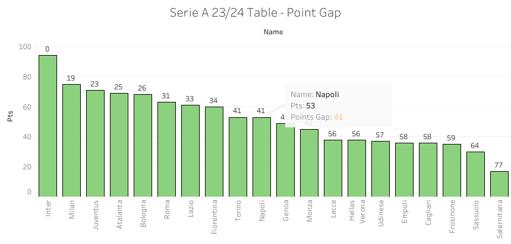
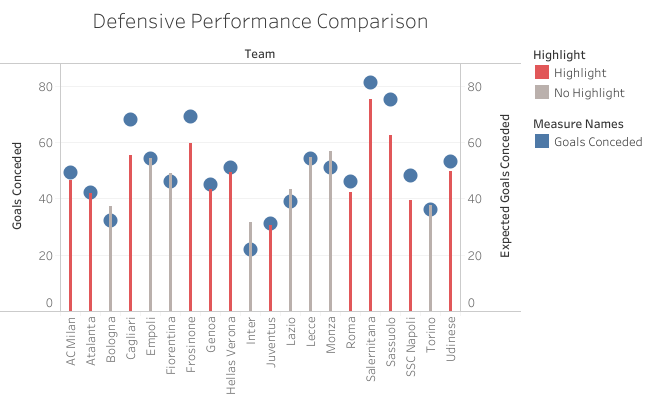
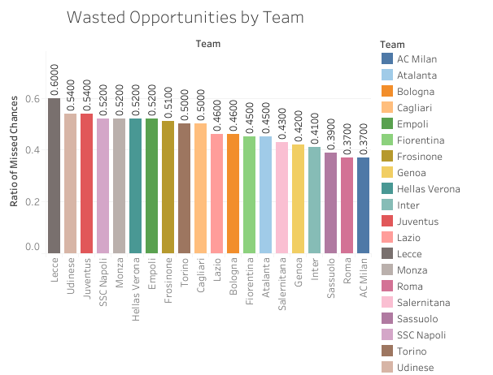
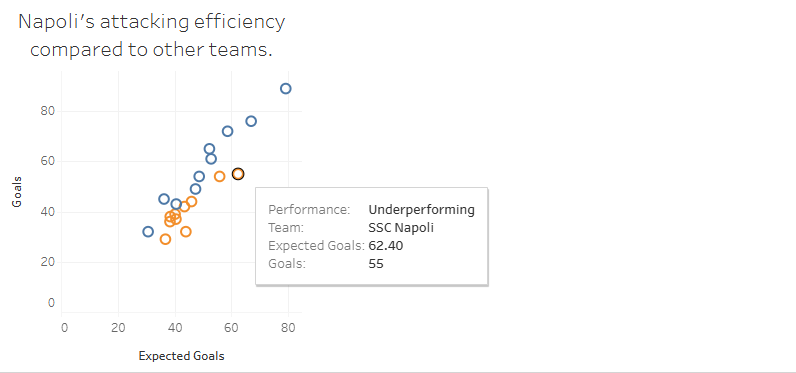
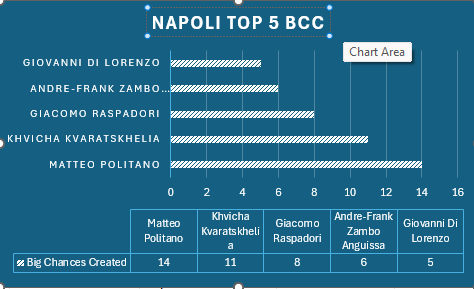
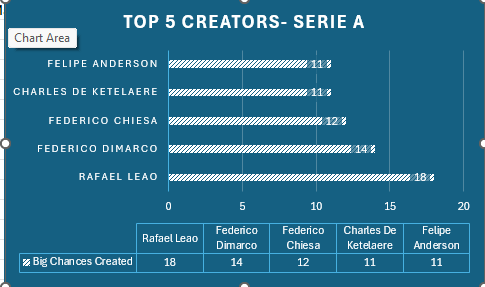
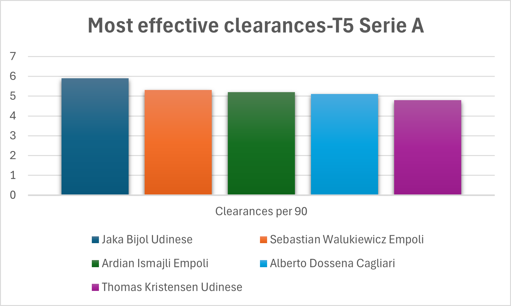

# Serie-A-analytics

# Information
About Dataset
Serie A 2023/24: Match, Player, and Team Performance Insights
Dataset Description
This [Dataset](https://www.kaggle.com/datasets/whisperingkahuna/serie-a-2324-team-and-player-insights)  offers an in-depth analysis of the 2023/24 Serie A season, capturing comprehensive data on team and player performances across all matchdays. With over 50 individual CSV files, this collection includes stats on passing accuracy, goal-scoring, defensive actions, possession metrics, and player ratings. Whether you're looking to analyze top scorers, assess team strengths, or delve into individual player contributions, this dataset provides a rich foundation for football analytics enthusiasts and professionals alike.

In addition to the core dataset, we have now added more files related to the league table, expanding the dataset with essential information on match outcomes, league standings, and advanced metrics.

Contents
The [Dataset](https://www.kaggle.com/datasets/whisperingkahuna/serie-a-2324-team-and-player-insights) contains the following types of data:

* Team Performance Metrics: Information on accurate passes, crosses, goals conceded, interceptions, and other team stats.
* Player Performance Metrics: Individual stats including expected goals (xG), assists, clearances, fouls committed, and tackles won.
* Match-Specific Insights: Detailed metrics on goals scored, scoring attempts, possession percentages, and cards issued per match.
* Match Details (New): Information about rounds, match IDs, teams, scores, and match statuses.
* League Tables (New):
  Overall standings including matches played, wins, draws, losses, goals scored, goal differences, and points.
  Separate breakdowns for home and away performances.
  Advanced metrics including expected goals (xG), expected goals conceded, and expected points.
  
The file details provide an overview of each [Dataset](https://www.kaggle.com/datasets/whisperingkahuna/serie-a-2324-team-and-player-insights) , including a brief description of the data structure and potential uses for analysis. This helps users quickly navigate and understand the data available for analysis.

# Context/ASK PHASE
I'm a data analyst at Napoli. The team failed to qualify for Champions league football after winning their legue the prior year. The club has put me in charge of spotting key metrics to analyze what went wrong and find pontential players they can add to the squad based on performance metrics from the 2023/2024 season.

Insights They Want:
* Scout potential transfer targets based on performance metrics.
  
  ### Use Case:
  Use effective clearance and shot conversion metrics to identify defenders who can strengthen the team's teams defense and attackers with poor shot conversions on team as well identify better options to improve the team.

# Prepare and Process PHASE
-The dataset from kaggle was already cleaned and ranked so it fufilled integrety requirements. However, the columns and names of some csv files useds had to be renamed to adhere to standard naming conventions.

-Tools Used for Analysis: SQLWorkBench, Tableau and Excel

8 Datasets were used for the analysis:
* league_table23_24
* expected_goals_conceded_team
* expected_goals_team
* big_chance_missed_team -- additional columns Total Attempts, Ratio of Missed Chances(changed to two decimal places) where created for visualization in table
* effective_clearance_team
* player_big_chances-created
* players_effective_clearances
* player_total_scoring_attempts

# Analyze PHASE

* Based of the requirements of the project I am going to analyze napolis performance at the team level and then proceed to assess how individuals on the team conntributed to that performance.

* After I'll proceed to assess the averages of certain metrics and investigate if players are above or below certain averages.

* I will then make recommendations of key players Napoli can scout based on individual performances across key metrics in the league-- for both offense and defense.

# Share PHASE

Results and Recommended Insightsbased on key findings will be given using Tableau

## Team Analysis

* Napoli's League Position: 10th place out of 20 teams.
* Points: 53, significantly behind the league leaders by 41pts (Inter with 94 points).
* Goal Difference: +7, which is far lower than teams in the top 4, such as Inter (+67).
* Goals Scored: 55, while conceding 48, highlighting a relatively average attacking and defensive performance.

Key Observations:

Goals Conceded: Napoli has conceded 55 goals, which is a relatively high number compared to the league average. This suggests that their defensive performance could be improved.

Expected Goals Conceded (xG): Napoli's xG is 45, which is lower than their actual goals conceded. This indicates that they might have been a bit unlucky, as they could have conceded fewer goals based on the quality of the chances created against them.

Inferences:

While Napoli's defensive performance isn't exceptional, their xG suggests that they might be able to improve their defensive record with better luck.
They might need to address some defensive vulnerabilities to reduce the number of high-quality chances they concede.

Key Observation:

Ratio of Missed Chances: The data shows that Napoli has a "Ratio of Missed Chances" of 0.52. This means that they have missed a significant number of scoring opportunities compared to other teams in the league.
Interpretation:

Wasted Opportunities: Napoli has not been efficient in converting their scoring chances into goals. This suggests that they need to improve their finishing and decision-making in the final third of the field.
Impact on Performance: This inefficiency in converting chances could be a factor in their overall performance, especially if they are competing for top positions in the league.

Key Observations:

Performing teams are highlighted in blue while underperforming teams are highlighted in orange

Expected Goals vs. Actual Goals: The graph compares Napoli's "Expected Goals" (xG) to their actual "Goals" scored. This indicates that Napoli has scored 55 goals, while their xG was 62.40.

Underperformance: The visualization labels Napoli as "Underperforming." This suggests that they have scored fewer goals than expected based on the quality of scoring chances they created.

Inferences:

Missed Opportunities: Napoli has missed a significant number of scoring opportunities, which has negatively impacted their goal-scoring output.
Finishing Issues: This underperformance might be attributed to issues with finishing, decision-making in the final third, or both.

## Player Analysis

### Attacking - Chances Created

* Matteo Politano leads the list for Napoli and is among the top 5 creators in the league based on rankings in the csv file.
* Players like Giovanni Di Lorenzo, Andre-Frank Zambo Anguissa, and Giacomo Raspadori are now prominent in the top 5 for Napoli, indicating their increased creative contributions.

Insights:

* Rafael Leao is the Top Creator: The chart clearly shows that Rafael Leao stands out as the top creator in Serie A with a significant lead, having created 18 "Big Chances."

* Close Competition: The next four players are closely grouped together. Federico Dimarco comes in second with 14 "Big Chances Created", followed by Federico Chiesa with 12. Charles De Ketelaere and Felipe Anderson both created 11 "Big Chances." These are player the scouting team should consider for the next transfer season

* "Big Chances" as the Metric: The visualization focuses on "Big Chances Created" as the measure of creative output. The chart highlights players who are particularly effective at creating high-quality scoring opportunities for their teammates.

### Attacking Recommendations

* Maintain Current Core: Given the strong showing of players like Matteo Politano, Khvicha Kvaratskhelia, and Giacomo Raspadori, Napoli should prioritize retaining these players. They are key contributors to the team's attacking prowess.

* Consider Depth at Winger Positions: While Politano and Kvaratskhelia are performing well, adding depth at the winger positions could provide valuable rotation options and cover for injuries. Players with strong dribbling and crossing abilities would be ideal targets.

### Defense

Team analysis showed napoli conceded more goals than their expected which means they were bad at clearances. The team should look to improve their squad with the best defensive talents in the league.

Insights
* Consistency Across Teams: Players from Udinese (Jaka Bijol, Thomas Kristensen) and Empoli (Sebastian Walukiewicz, Ardian Ismajli) dominate the rankings, suggesting these teams rely heavily on their defenders to clear the ball effectively.
* Effective Defenders: These players are crucial to their teams’ defensive efforts, indicating strong positioning and awareness.
* Strategic Advantage: Teams with players high in clearances might focus on aerial duels or defensive organization under pressure, relying on these players for last-line defense.

### Defensive recomendations
These insights suggests that recruiting players like Jaka Bijol or Sebastian Walukiewicz could improve defensive stability.

